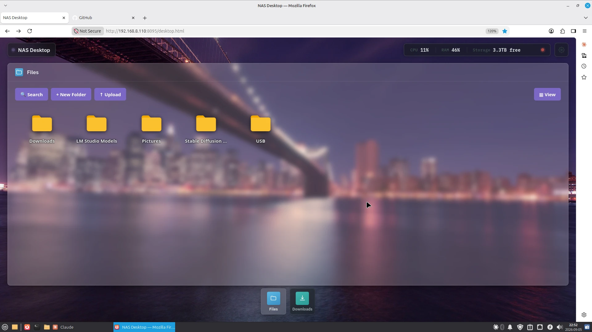
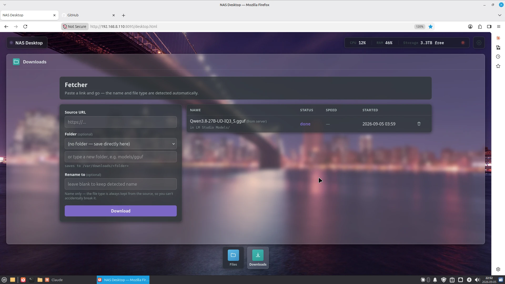
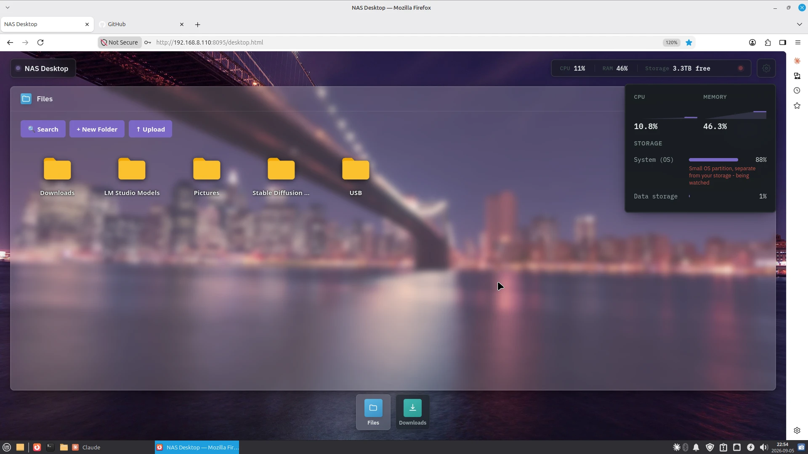
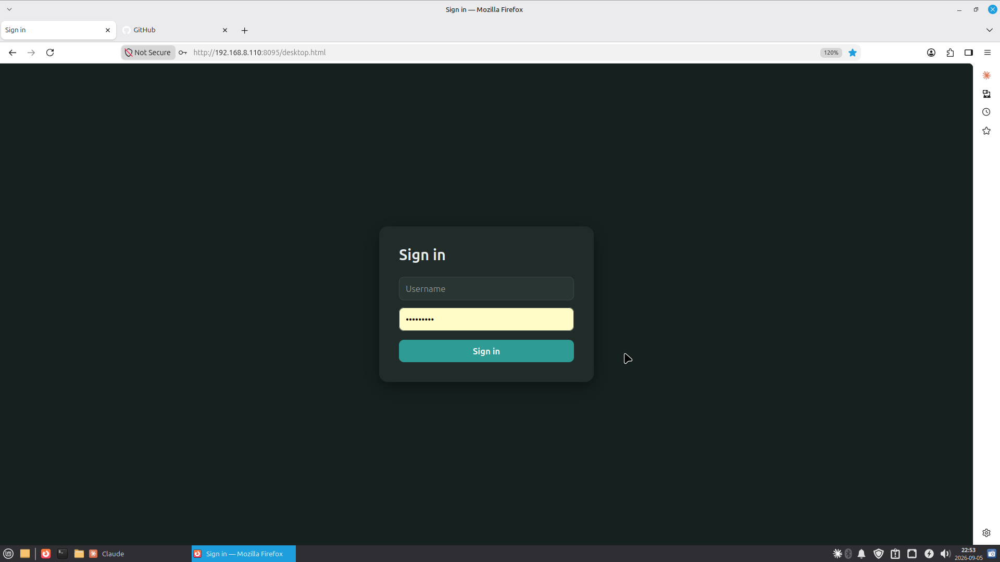

# LegasyNAS

A small, self-contained control panel for an old Linux NAS: a file manager, a
download manager, and a desktop-style shell that ties them together — all
pure Python 3 standard library, no dependencies to install, no database, no
build step.

It was built for (and still runs on) a Buffalo LinkStation LS210D re-flashed
with plain Debian, but nothing in it is specific to that box anymore — see
[Requirements](#requirements) and [Known limitations](#known-limitations)
for exactly how far that portability claim goes.






## What's included

- **Files** — a browser-based file manager scoped to one root directory:
  browse, upload, rename, move, delete, compress/extract archives, and
  automatic mounting of USB sticks plugged into the NAS (FAT/exFAT/ext2/3/4;
  see limitations for what's not supported). Copying, moving, zipping and
  extracting run in the background with a live progress bar, so a multi-GB job
  never freezes the page, and any failure is reported rather than swallowed.
  Downloads are resumable, so an interrupted 12 GB download picks up where it
  stopped instead of starting over. Drives plugged into the NAS get an **Eject**
  button (and a right-click "Eject drive"), and a copy aimed at the `USB` folder
  with no drive mounted is refused instead of quietly filling the NAS's own disk.
- **Fetcher** — paste a URL, pick a destination folder, and it downloads
  server-side with automatic retry, pause/resume, and filename/type
  detection — useful for pulling large files onto the NAS without going
  through your own machine first.
- **Desktop shell** — a single page that hosts both apps side by side (dock,
  window chrome, live CPU/RAM/storage via [Glances](https://nicolargo.github.io/glances/)),
  plus light/dark theme, wallpaper and accent-color pickers, and NAS-level
  restart/shutdown buttons. A copy/move/zip in progress shows a live progress bar
  next to the NAS name at the top, and system messages (a job finished or failed,
  a USB drive connected, ejected, or pulled out without ejecting) pop up in the
  bottom-right corner.
- **Optional login** — a shared session across all three services (log in
  once, stay logged in everywhere), off by default. See
  [Login](#login-optional).
- **USB automount** — a udev rule + script that mounts a plugged-in USB
  stick straight into the Files app's root, with no configuration.

## Requirements

- A **systemd-based Linux** box. The installer checks for systemd and
  refuses to run otherwise — OpenRC, SysVinit, and other init systems
  aren't supported by this version.
- **Python 3** (stdlib only — nothing to `pip install`).
- `udevadm`, `blkid`, `mountpoint`, `findmnt`, `lsblk`, `visudo` — all
  standard on any systemd-based distro; the installer checks for these and
  tells you if one's missing.
- An existing, unprivileged **user account** to run the services as (the
  installer won't create one for you).
- `sudo` available, with permission to add sudoers.d rules (needed for the
  NAS restart/shutdown buttons and the USB Eject button - each gets its own
  narrow rule, generated and validated by the installer).

This has been tested on exactly one device — see
[Known limitations](#known-limitations) for what that does and doesn't mean
for your hardware.

## Install

```bash
git clone https://github.com/andriitez-svg/LegasyNAS.git
cd LegasyNAS
sudo ./install.sh
```

It will ask a handful of questions (which user to run as, where to put the
files, which ports to use, whether to require a login) and fall back to
sensible defaults if you just press Enter — or run it non-interactively with
environment variables:

| Variable | Prompt it answers | Default |
|---|---|---|
| `LEGASYNAS_SERVICE_USER` | User to run the services as | existing config, else `debian` |
| `LEGASYNAS_INSTALL_DIR` | Where to put the app files | `/opt/legasynas` |
| `LEGASYNAS_ROOT_DIR` | Shared data root (Files + Fetcher) | `/var/downloads` |
| `LEGASYNAS_PORT_FILES` | Files app port | `8093` |
| `LEGASYNAS_PORT_FETCHER` | Fetcher port | `8092` |
| `LEGASYNAS_PORT_DESKTOP` | Desktop shell port | `8095` |
| `LEGASYNAS_DATA_MOUNT` | Mountpoint the storage tile reports on | `/mnt/data` |
| `LEGASYNAS_INTERNAL_DISK_PREFIX` | Device-name prefix USB automount must never touch | `sda` |
| `LEGASYNAS_ENABLE_AUTH` | Require a login (`y`/`n`) | `n` |
| `LEGASYNAS_AUTH_USER` | Login username | `admin` |
| `LEGASYNAS_AUTH_PASSWORD` | Login password | generated and printed once if left blank |

The last four only apply to a fresh install — if `/etc/legasynas.conf`
or `/etc/legasynas-auth.conf` already exist, the installer leaves
them alone and reports that it did.

Re-running `install.sh` at any point (after a `git pull`, or to change which
user/ports it's using) is safe — it reconciles the existing install rather
than duplicating anything, and finishes by running its own smoke test
against the box.

Once it's done, open `http://<nas-address>:8095/desktop.html`.

## Configuration

Everything the three services need to agree on lives in one file,
`/etc/legasynas.conf` (`config/legasynas.conf.default` in
this repo is the template `install.sh` copies from). Edit it and restart the
three services (`systemctl restart filemgr fetcher desktop`) to pick up a
change — there's no need to re-run the installer for that.

## Login (optional)

Off by default. If you enabled it during install (or want to turn it on
later), re-run `install.sh` and answer yes when it asks. Once it's on:

- Logging in via any one of the three ports authenticates the other two
  automatically — there's no separate login for Fetcher vs. Files vs. the
  shell.
- The password can be changed from the shell itself: gear icon → Security →
  Change password. No SSH access needed.
- Changing the password signs out every other active session immediately.
- Passwords are never stored — only a salted PBKDF2-SHA256 hash.

This is meant to keep other people on the same LAN out, not to make it safe
to expose the NAS to the internet. Don't port-forward any of this.

## USB automount

Plug a stick in and it shows up inside the Files app automatically, under a
`USB/` folder — no setup needed. It's identified as removable USB storage at
the kernel level (not by name or filesystem type), and the automount script
independently re-verifies that before ever mounting anything, so it can't be
tricked into mounting an internal disk. Unplugging cleans up after itself.

**Eject before you unplug.** Each drive in the `USB` folder has an **Eject**
button (also in the right-click menu). It flushes everything to the drive and
unmounts it, and refuses - with the reason - if a copy is still using it or a
file is open over the network. Pulling a drive out *without* ejecting raises a
warning in the corner, since anything still being written may be incomplete. The
web apps are unprivileged, so this goes through one small root-owned helper
(`usb-eject`) allowed by a single sudoers rule; it re-checks that the target
really is a removable USB drive, so it can't be pointed at the system or data
disk.

One thing to know about drive formatting: **FAT32 cannot hold a file of 4 GB or
more** — that's the filesystem, not the NAS. Copying a big video or model file
onto a FAT32 stick is refused up front with a clear message (instead of failing
4 GB into the copy). Format drives you'll put big files on as exFAT or ext4.

## Known limitations

- **The SMB share (if you set one up separately) has no login of its own**,
  regardless of whether the web apps' login is enabled.
- **No sleep/suspend mode.** Investigated on the original hardware and found
  infeasible there (no wake-on-LAN, broken CPU idle states, no drive APM
  support) — not attempted on other hardware.
- **NTFS USB sticks are not supported.** FAT, exFAT, ext2/3/4 work.
- **FAT32 drives can't hold files of 4 GB or more** (a filesystem limit, on the
  NAS's USB port or on any external drive you copy to). The Files app refuses
  such a copy before starting it; use exFAT or ext4 for big files.
- **systemd only** — see [Requirements](#requirements).
- **Tested on exactly one device**: a Buffalo LinkStation LS210D running
  Debian 12 (bookworm), armv7l, single ~800MHz core. Everything here works
  on that box, confirmed by actually running it, not just reviewing the
  code. Portability to other systemd-based NAS hardware is a design-review
  judgment, not something that's been tested on a second machine — there
  isn't one available to test against. If you run this on different
  hardware and something in the udev rule, the sudoers generation, or the
  USB automount logic doesn't hold up, that's the most likely place to look
  first.

## Repo layout

```
filemanager.py, fetcher.py, serve.py, desktop.html   the four services
install.sh                                            installer
config/legasynas.conf.default                 default shared config
templates/*.service.tmpl                              systemd unit templates
usb-automount, 99-usb-automount.rules, usb-eject      USB automount + safe eject
smoke_test.sh                                         post-deploy regression check
tests/                                                automated tests (python3 tests/test_filemanager_bigfiles.py)
```

## License

MIT — see [LICENSE](LICENSE).
